# 🚀 Distributed URL Shortener

A scalable URL shortening service inspired by Bitly and TinyURL, built using Java, Spring Boot, PostgreSQL, Redis, Kafka, Docker, and NGINX.

The project explores backend engineering concepts such as caching, asynchronous processing, rate limiting, database optimization, and load balancing.

## Features

### Core Features

* Generate short URLs using Base62 encoding
* Redirect short URLs to original URLs
* URL expiration support (TTL-based)
* Click analytics tracking

### Scalability Features

* Redis caching for faster URL resolution
* Database indexing for optimized lookups
* API rate limiting to prevent abuse
* NGINX load balancing simulation
* Kafka-based asynchronous event logging

## Tech Stack

* Java 17
* Spring Boot
* PostgreSQL
* Redis
* Apache Kafka
* Docker
* NGINX
* Maven

# Architecture


The system uses NGINX for load balancing, Redis for low-latency URL resolution, PostgreSQL for persistence, and Kafka for asynchronous analytics processing.

# Redirect Flow


Redirect requests follow a cache-aside strategy where Redis serves hot URLs and PostgreSQL is consulted only on cache misses.

# Analytics Pipeline


Analytics events are processed asynchronously through Kafka so that redirect latency remains unaffected by analytics workloads.


## API Endpoints

### Create Short URL

POST `/api/urls`

Request

```json
{
  "url": "https://github.com",
  "ttlSeconds": 86400
}
```

Response

```json
{
  "code": "abc123",
  "shortUrl": "http://localhost:8080/abc123",
  "originalUrl": "https://github.com",
  "ttlSeconds": 86400
}
```

### Redirect

GET `/{code}`

Returns HTTP 308 Permanent Redirect.

### Analytics

GET `/api/urls/{code}`

Returns click statistics and URL metadata.

## Running Locally

```bash
docker-compose up -d
mvn spring-boot:run
```

Application:

http://localhost:8080

## Key Learnings

* Cache-aside pattern using Redis
* Event-driven architecture using Kafka
* Database indexing and query optimization
* API rate limiting techniques
* Load balancing concepts using NGINX
* Building scalable backend systems with Spring Boot

## Future Improvements

* Distributed Redis cluster
* Bloom filters
* QR code generation
* Kubernetes deployment
* Multi-region support
* Real-time analytics dashboard

```
```
